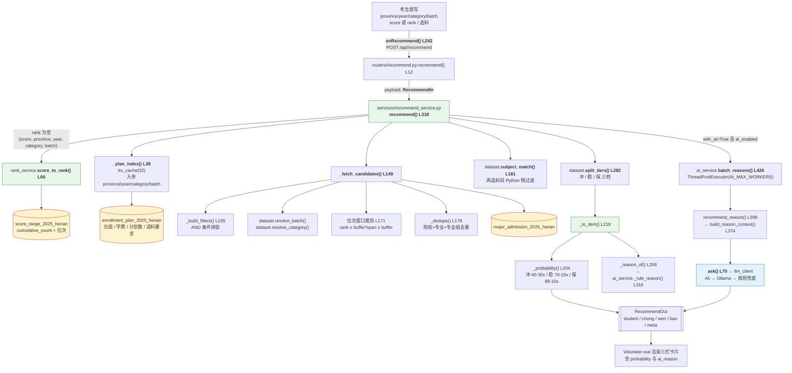
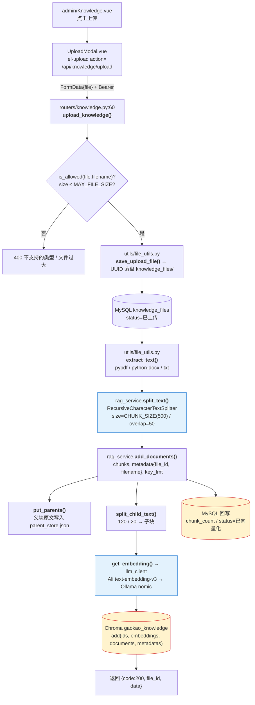
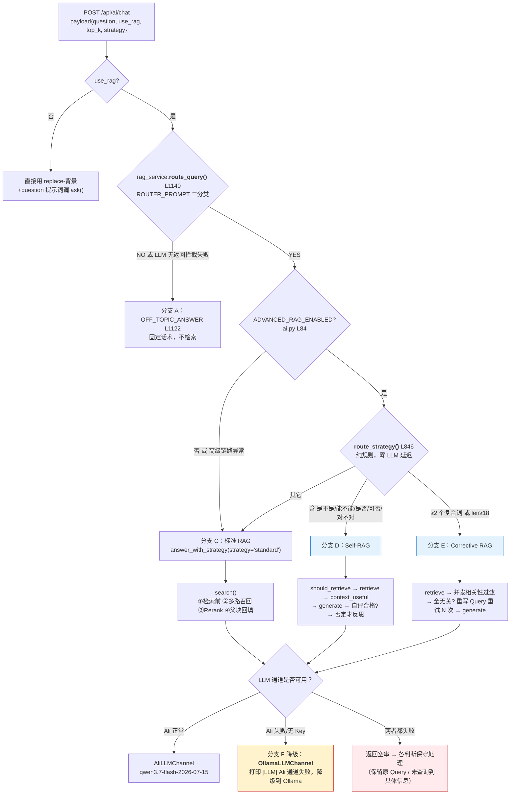
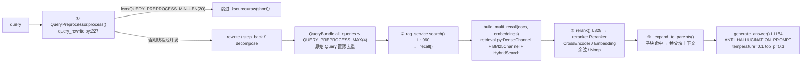

# 高考志愿填报系统（河南 2024-2025）+ RAG 知识库

基于河南 2024-2025 年高考录取数据，构建「冲 / 稳 / 保」三档志愿推荐系统，
并在其上扩展了独立的 **RAG 知识库模块**（Chroma 向量库 + Ali 大模型 + 本地 Ollama 兜底）。

核心分工：

- **规则引擎负责计算**：分数 → 位次换算、分档、筛选过滤、概率估算
- **本地大模型负责理解与表达**：自然语言意图解析、推荐理由生成、知识库问答
- **RAG 负责政策类问答**：上传政策文档 → 递归切片 → 向量化 → 多路召回 → 精排 → 拼进 Prompt
- **物理隔离维度**：所有查询必须带 `province + year + category + batch`

> ℹ️ 本文所有「文件 → 函数 → 参数 → 下一个调用点」均按当前代码实写（v2.5.1），
> 行号随版本迭代会漂移，函数名与参数名为准。

---

## 一、项目速览

一段话：**规则引擎算得准，大模型说得清。** 志愿推荐的分档与概率完全由 SQL + Python 规则决定，
AI 只承担「把自然语言翻译成筛选条件」和「把计算结果翻译成人话」两件事；
政策类问答则走完整的 RAG 链路（检索前改写 → 多路召回 → Rerank 精排 → Self-RAG / Corrective RAG → 防幻觉生成）。
任一环节失败都会**静默降级**：推荐理由退化为规则文案、Embedding 退化为本地模型、LLM 退化为本地 Ollama。

### 技术栈一览

> ★ = 该技术的配置项所在位置；★★★ = 需要你手动改的配置文件

| 层次 | 技术 | 说明 | 配置位置 |
|---|---|---|---|
| 前端框架 | Vue 3 + TypeScript + Vite | 组合式 API，`/api` 反向代理到 8000 | ★ `frontend/vite.config.ts` |
| UI 库 | Element Plus | 表单 / 表格 / 上传 / 消息 | ★ `frontend/src/main.ts`（全量注册） |
| 状态管理 | Pinia | `user`（登录态）、`knowledge`（文件与向量库状态） | ★ `frontend/src/stores/*.ts` |
| 图表 | ECharts + 中国地图 GeoJSON | 首页「各省在豫招生专业数」热力地图 | ★ `frontend/src/views/student/Home.vue:116` |
| 后端框架 | FastAPI | 路由按域拆分，全局 `TableNotFound` 处理 | ★ `backend/app/main.py:32-41` |
| 数据访问 | SQLAlchemy Core + PyMySQL | 动态反射表 + `fetch_all()` 返回 dict | ★ `backend/app/database.py:64` |
| 数据库 | MySQL（`gaokao`） | 录取 / 计划 / 一分一段 / 用户 / 知识文件 | ★ `backend/.env`（DB_*） |
| 鉴权 | JWT（python-jose）+ bcrypt（passlib） | `admin` / `student` 两种角色 | ★ `backend/app/utils/security.py` |
| 向量库 | Chroma `PersistentClient` | 集合 `gaokao_knowledge`，落盘 `backend/chroma_db/` | ★ `CHROMA_DB_PATH` / `CHROMA_COLLECTION` |
| 大语言模型 | **阿里云 OpenAI 兼容接口** | `qwen3.7-flash-2026-07-15`，专用工作空间域名 | ★ `Ali_API_KEY` / `ALI_BASE_URL` / `ALI_LLM_MODEL` |
| LLM 兜底 | Ollama `qwen3:1.7b` | Ali 不可用自动降级，离线可跑 | ★ `OLLAMA_FALLBACK_MODEL` / `OLLAMA_URL` |
| Embedding | Ali `text-embedding-v3` | 与 LLM 共用同一个 Key 与 base_url，维度对齐已有集合 | ★ `ALI_EMBED_MODEL` / `ALI_EMBED_DIMENSION` |
| Embedding 兜底 | Ollama `nomic-embed-text` | 768 维，离线可用 | ★ `OLLAMA_EMBED_MODEL` |
| 文档解析 | pypdf / python-docx | PDF / DOCX / TXT 文本提取 | ★ `backend/app/utils/file_utils.py` |

<span style="color:#d32f2f; background-color:#fff3cd">★★★ 配置文件清单 ★★★</span>

| 文件 | 改什么 |
|---|---|
| `backend/.env`（由 `.env.example` 复制） | 数据库连接、<b>Ali_API_KEY</b>、ALI_BASE_URL、模型名、开关 |
| `backend/app/config.py` | 所有配置项的**读取入口**与默认值（`_env()` + 极简 dotenv 加载） |
| `backend/requirements.txt` | Python 依赖（v2.5.1 起：`openai>=1.0`，移除 `dashscope`） |
| `frontend/vite.config.ts` | 端口 5173、`/api` 代理、别名 `@` |
| `frontend/tsconfig.json` | TS 编译选项、`paths` 别名 |
| `frontend/.npmrc.local` | npm 代理走不通时用 `npm i --userconfig .npmrc.local` |

---

## 二、目录结构与文件职责（★ 醒目标注）

> 图例：
> <span style="color:#d32f2f; background-color:#fff3cd">★★★ 配置文件 ★★★</span>
> <span style="color:#1976d2; background-color:#e3f2fd">🔷 RAG 核心</span>
> <span style="color:#388e3c; background-color:#e8f5e9">🟢 业务核心</span>

### 2.1 仓库总览

```
gaokao_project/
├── backend/                      <span style="color:#888">// FastAPI 服务：业务规则 + RAG + AI</span>
├── frontend/                     <span style="color:#888">// Vue3 + TS 单页应用</span>
├── gaokao_data/                  <span style="color:#888">// 原始录取数据（MySQL 建库用）</span>
├── CHANGELOG.md                  <span style="color:#888">// 版本迭代记录（每个版本的「原有缺陷 → 改进 → 验证」）</span>
├── README.md                     <span style="color:#888">// 本文</span>
└── 导入数据集.py                  <span style="color:#888">// CSV → MySQL 一次性导入脚本</span>
```

### 2.2 `backend/`

```
backend/
├── app/
│   ├── main.py                   <span style="color:#888">// FastAPI 入口：注册 8 个路由、CORS、SPA 回退、启动时补索引</span>
│   ├── config.py                 <span style="color:#888">// 全局配置：DB / Ollama / Ali / Chroma / JWT / RAG 开关</span>  <span style="color:#d32f2f; background-color:#fff3cd">★★★ 配置文件 ★★★</span>
│   ├── database.py               <span style="color:#888">// 引擎、表反射、`fetch_all/fetch_one/fetch_*_params`、幂等建索引</span>  <span style="color:#388e3c; background-color:#e8f5e9">🟢 业务核心</span>
│   ├── models/                   <span style="color:#888">// 动态表解析 + ORM 模型（与 SQL 表一一对应）</span>
│   │   ├── dataset.py            <span style="color:#888">// 表名拼接 `table_name()`、维度归一 `resolve_batch/category`、选科匹配 `subject_match()`</span>  <span style="color:#388e3c; background-color:#e8f5e9">🟢 业务核心</span>
│   │   ├── knowledge.py          <span style="color:#888">// ORM：knowledge_files（上传文件台账）</span>
│   │   └── user.py               <span style="color:#888">// ORM：users（admin / student）</span>
│   ├── schemas/                  <span style="color:#888">// Pydantic 出入参模型（请求体与响应体的唯一契约）</span>
│   │   ├── student.py            <span style="color:#888">// RecommendIn / RecommendFilters / RecommendItem / ScoreToRankOut …</span>  <span style="color:#388e3c; background-color:#e8f5e9">🟢 业务核心</span>
│   │   ├── knowledge.py          <span style="color:#888">// SearchOut / ChunkHit / KnowledgeFileOut</span>  <span style="color:#1976d2; background-color:#e3f2fd">🔷 RAG 核心</span>
│   │   └── user.py               <span style="color:#888">// 登录注册入参、UserInfo</span>
│   ├── routers/                  <span style="color:#888">// 接口层：只做参数校验与异常映射，业务逻辑一律下沉 service</span>
│   │   ├── ai.py                 <span style="color:#888">// /api/ai/chat（RAG 问答，v2.5.0 起返回 strategy/steps）、parse-intent、recommend-reason、status</span>
│   │   ├── auth.py               <span style="color:#888">// /api/auth/login|register|me，JWT 依赖 get_current_user / get_current_admin</span>
│   │   ├── knowledge.py          <span style="color:#888">// /api/knowledge/upload|list|detail|download|delete|search|status（admin 读写，search 全员）</span>  <span style="color:#1976d2; background-color:#e3f2fd">🔷 RAG 核心</span>
│   │   ├── meta.py               <span style="color:#888">// /api/score-table|control-lines|score-check（一分一段 / 批次线）</span>
│   │   ├── recommend.py          <span style="color:#888">// /api/recommend（主链路）、/api/recommend/ai-reasons（批量理由）</span>  <span style="color:#388e3c; background-color:#e8f5e9">🟢 业务核心</span>
│   │   ├── stats.py              <span style="color:#888">// /api/stats/major-count-by-province（首页地图数据）</span>
│   │   ├── student.py            <span style="color:#888">// /api/student/profile、/api/score-to-rank、/api/rank-to-score</span>
│   │   └── university.py         <span style="color:#888">// /api/universities、/api/majors（复用 recommend_service._probability）</span>
│   ├── services/                 <span style="color:#888">// 业务与算法层（所有计算发生在这里）</span>
│   │   ├── recommend_service.py  <span style="color:#888">// 冲稳保规则引擎：候选拉取 → 位次窗口 → 去重 → 分档 → 概率估算</span>  <span style="color:#388e3c; background-color:#e8f5e9">🟢 业务核心</span>
│   │   ├── rank_service.py       <span style="color:#888">// 一分一段：score_to_rank / rank_to_score / control_lines / score_check</span>  <span style="color:#388e3c; background-color:#e8f5e9">🟢 业务核心</span>
│   │   ├── ai_service.py         <span style="color:#888">// 意图解析、推荐理由、统一 ask() 入口（Ali → Ollama）</span>
│   │   ├── llm_client.py         <span style="color:#888">// LLM/Embedding 通道：AliLLMChannel / AliEmbeddingChannel / Ollama* + 门面降级</span>  <span style="color:#1976d2; background-color:#e3f2fd">🔷 RAG 核心</span>
│   │   ├── rag_service.py        <span style="color:#888">// RAG 主控：Chroma 读写、父子树、search()、rerank()、route_strategy()、answer_with_strategy()</span>  <span style="color:#1976d2; background-color:#e3f2fd">🔷 RAG 核心</span>
│   │   ├── query_rewrite.py      <span style="color:#888">// 检索前：重写 / 扩展(Step-Back) / 子查询分解（线程池并发）</span>  <span style="color:#1976d2; background-color:#e3f2fd">🔷 RAG 核心</span>
│   │   ├── retrieval.py          <span style="color:#888">// 检索中：DenseChannel / BM25Channel / HybridSearch / MultiRecall（三通道 × 多 Query）</span>  <span style="color:#1976d2; background-color:#e3f2fd">🔷 RAG 核心</span>
│   │   ├── reranker.py           <span style="color:#888">// 检索后：CrossEncoder / Embedding 余弦 / Noop 三种精排 + 失败降级</span>  <span style="color:#1976d2; background-color:#e3f2fd">🔷 RAG 核心</span>
│   │   ├── self_rag.py           <span style="color:#888">// Self-RAG：要不要检索 → 上下文有没有用 → 生成 → 自评不合格才反思</span>  <span style="color:#1976d2; background-color:#e3f2fd">🔷 RAG 核心</span>
│   │   └── corrective_rag.py     <span style="color:#888">// Corrective RAG：相关性过滤 → 全部无关则重写 Query 再检索</span>  <span style="color:#1976d2; background-color:#e3f2fd">🔷 RAG 核心</span>
│   └── utils/
│       ├── file_utils.py         <span style="color:#888">// UUID 落盘、类型白名单、PDF/DOCX/TXT 提取、20MB 限制</span>
│       └── security.py           <span style="color:#888">// bcrypt 哈希校验 + JWT 签发/解析</span>
├── sql/
│   ├── 03_knowledge.sql          <span style="color:#888">// 旧版 knowledge_files（历史归档）</span>
│   └── 04_rag_tables.sql         <span style="color:#888">// 新版 users + knowledge_files 建表</span>
├── knowledge_files/              <span style="color:#888">// 上传的原始文件（UUID 重命名，已 gitignore）</span>
├── chroma_db/                    <span style="color:#888">// Chroma 持久化目录（sqlite3 + 向量分片，已 gitignore）</span>
├── .env                          <span style="color:#888">// 本地真实配置（不入库）</span>  <span style="color:#d32f2f; background-color:#fff3cd">★★★ 配置文件 ★★★</span>
├── .env.example                  <span style="color:#888">// 配置模板（含 Ali_* 全部说明）</span>  <span style="color:#d32f2f; background-color:#fff3cd">★★★ 配置文件 ★★★</span>
├── requirements.txt              <span style="color:#888">// Python 依赖清单</span>  <span style="color:#d32f2f; background-color:#fff3cd">★★★ 配置文件 ★★★</span>
├── smoke_test.py                 <span style="color:#888">// 14 个业务接口冒烟</span>
├── smoke_rag.py                  <span style="color:#888">// RAG 全链路冒烟：登录 → 上传 → 检索 → 问答 → 删除</span>
├── test_llm_channel.py           <span style="color:#888">// v2.5.1：LLM/Embedding 通道自检 + 端到端 10 秒验证</span>
├── test_advanced_rag.py          <span style="color:#888">// v2.5.0：精排 + 三条高级链路对比（强制本地兜底）</span>
├── test_query_preprocess_recall.py <span style="color:#888">// v2.4.1：检索前预处理 + 多路召回</span>
├── test_multi_query.py           <span style="color:#888">// v2.4.0：Query 分解 + 跨路 RRF</span>
├── test_parent_child.py          <span style="color:#888">// v2.2.0：父子块检索</span>
├── test_hybrid_search.py         <span style="color:#888">// v2.1.0：混合检索 + RRF 融合</span>
└── test_anti_hallucination.py    <span style="color:#888">// v2.3.x：路由 + 防幻觉拒答</span>
```

### 2.3 `frontend/`

```
frontend/
├── src/
│   ├── main.ts                   <span style="color:#888">// 应用入口：createApp + Pinia + Router + ElementPlus + 图标全局注册</span>
│   ├── App.vue                   <span style="color:#888">// 根布局：Navbar + RouterView</span>
│   ├── router/index.ts           <span style="color:#888">// 8 条路由 + 全局守卫（admin 路由校验 role）</span>
│   ├── api/                      <span style="color:#888">// 所有 HTTP 请求集中在此（组件不写 URL）</span>
│   │   ├── request.ts            <span style="color:#888">// axios 实例（baseURL=/api, timeout=60s）+ Token 注入 + 401/403 处理</span>
│   │   ├── recommend.ts          <span style="color:#888">// recommend / scoreCheck / controlLines / listUniversities / listMajors / majorCountByProvince</span>
│   │   ├── knowledge.ts          <span style="color:#888">// upload / list / detail / delete / search / ragStatus</span>  <span style="color:#1976d2; background-color:#e3f2fd">🔷 RAG 核心</span>
│   │   ├── ai.ts                 <span style="color:#888">// chat（timeout 120s）/ aiStatus / parseIntent</span>
│   │   └── auth.ts               <span style="color:#888">// login / register / fetchMe</span>
│   ├── stores/
│   │   ├── user.ts               <span style="color:#888">// token + user（派生 isLogin / role / isAdmin）</span>
│   │   └── knowledge.ts          <span style="color:#888">// files / keyword / backend 状态与动作</span>
│   ├── views/
│   │   ├── Login.vue             <span style="color:#888">// 登录；按 role 跳 `/admin/knowledge` 或 `/`</span>
│   │   ├── student/
│   │   │   ├── Home.vue          <span style="color:#888">// 首页 ECharts 中国地图 + 快捷工具入口</span>
│   │   │   ├── Volunteer.vue     <span style="color:#888">// 志愿填报主页面（分数 → 位次 → 冲稳保）</span>  <span style="color:#388e3c; background-color:#e8f5e9">🟢 业务核心</span>
│   │   │   ├── University.vue    <span style="color:#888">// 查大学 / 查专业（分页表格）</span>
│   │   │   └── AiChat.vue        <span style="color:#888">// AI 问答（可开关知识库增强，展示 sources）</span>  <span style="color:#1976d2; background-color:#e3f2fd">🔷 RAG 核心</span>
│   │   └── admin/
│   │       ├── Dashboard.vue     <span style="color:#888">// 后台首页：文件数 + 向量库状态（RagBackendInfo）</span>
│   │       └── Knowledge.vue     <span style="color:#888">// 知识库管理：列表 / 搜索 / 上传 / 详情 / 删除</span>  <span style="color:#1976d2; background-color:#e3f2fd">🔷 RAG 核心</span>
│   ├── components/
│   │   ├── Navbar.vue            <span style="color:#888">// 顶部导航 + 登录态 + 退出</span>
│   │   ├── UploadModal.vue       <span style="color:#888">// el-upload 直传 /api/knowledge/upload（自带 Bearer）</span>
│   │   └── ChatBubble.vue        <span style="color:#888">// 聊天气泡纯展示组件</span>
│   ├── types/                    <span style="color:#888">// TS 类型：recommend / knowledge / user</span>
│   └── styles/main.css           <span style="color:#888">// 全局样式与 CSS 变量</span>
├── index.html                    <span style="color:#888">// Vite 入口 HTML</span>
├── vite.config.ts                <span style="color:#888">// dev server + /api 代理 + @ 别名</span>  <span style="color:#d32f2f; background-color:#fff3cd">★★★ 配置文件 ★★★</span>
├── tsconfig.json                 <span style="color:#888">// TS 编译配置</span>  <span style="color:#d32f2f; background-color:#fff3cd">★★★ 配置文件 ★★★</span>
├── package.json                  <span style="color:#888">// 依赖与 scripts（dev / build / preview）</span>  <span style="color:#d32f2f; background-color:#fff3cd">★★★ 配置文件 ★★★</span>
├── .npmrc.local                  <span style="color:#888">// npm 本地代理兜底配置</span>  <span style="color:#d32f2f; background-color:#fff3cd">★★★ 配置文件 ★★★</span>
├── dist/                         <span style="color:#888">// 构建产物（生产模式下由 FastAPI 托管）</span>
├── public/china.json             <span style="color:#888">// 中国地图 GeoJSON（首页 `fetch('/china.json')` 加载）</span>
└── _legacy/                      <span style="color:#888">// 旧版原生 JS 前端（已归档，不参与构建）</span>
```

---

## 三、业务模块调用流程（★ 详细到参数级别）

### 3.1 端到端流程图：志愿填报



### 3.2 代码级调用树（参数级）

<details>
<summary><b>展开： /api/recommend 完整调用树（文件 → 函数 → 关键参数）</b></summary>

```
POST /api/recommend                                     routers/recommend.py:12  recommend()
│   body: RecommendIn(province="河南", year=2025, category="物理类", batch="本科批",
│                     score?, rank?, filters?, buffer?, span_factor?,
│                     limit=60, with_ai=False, ai_limit=8)
│   异常映射 L34-37：ValueError → 400，其它 → 500
└─► services/recommend_service.py:318  recommend(province, year, category, batch,
                                                rank=None, score=None, filters=None,
                                                buffer=None, span_factor=None,
                                                limit=60, with_ai=False, ai_limit=0)
    │
    ├─① services/rank_service.py:66  score_to_rank(province, year, category, batch, score)
    │   └─ _load_score_range(province, year, category, batch=None)  :28
    │       └─ models/dataset.py:64  table_name("score_range", year, province)   → "score_range_2025_henan"
    │           └─ database.py:48  get_table(name)           → 反射 Table（缓存）
    │               └─ database.py:64  fetch_all(select(...)) → List[Dict]
    │   ↳ 返回 {score, rank, segment_count, rank_range, control_score, batch_used, exact, score_diff}
    │
    ├─② _plan_index(province, year, category, batch)   :38   @lru_cache(32)
    │   └─ enrollment_plan_2025_henan → 三级索引 {code / name / school: {tuition, plan_count, duration, subject_req}}
    ├─③ _lookup_plan(idx, uni_code, uni_name, major_code, major_name)  :86   代码 > 名称 > 校名
    │
    ├─④ _fetch_candidates(province, year, category, batch, filters, rank, buffer, span)  :149
    │   ├─ _build_filters(tbl, filters)  :105
    │   │    AND: min_rank IS NOT NULL
    │   │         major_name/major_group/major_note LIKE %major_keyword%
    │   │         不含 exclude_keyword / university_keyword LIKE / school_province=
    │   │         school_nature= / subject_req LIKE / is_985=1 / is_211=1
    │   ├─ models/dataset.py:75/103  resolve_batch() / resolve_category()   ← 2024 表结构特判
    │   ├─ L171-172 位次窗口：min_rank ∈ [rank - buffer*span - buffer, rank + buffer*span + buffer]
    │   └─ _dedupe(rows)  :178   院校+专业+专业组唯一（留 min_rank 最小）
    │
    ├─⑤ models/dataset.py:181  subject_match(subject_req_text, filters.subject_selected)
    │       "不限"/空 → 放行；含"或" → 任一命中；≥2 门或含"必选" → 必须全含
    ├─⑥ filters.tuition_max  Python 侧再过滤  :364-368
    │
    ├─⑦ split_tiers(rows, rank, buffer=settings.RANK_BUFFER, span=settings.RANK_SPAN_FACTOR, limit)  :282
    │       rank-lo ≤ min_rank < rank-buffer        → chong（按 min_rank 降序）
    │       |min_rank - rank| ≤ buffer              → wen （按 |差值| 升序）
    │       rank+buffer < min_rank ≤ rank+lo        → bao （按 min_rank 升序）
    │       池空自动放宽上下界（保证不返回空页）
    │
    ├─⑧ _to_item(row, rank, tier, buffer, span, plan)  :219
    │   ├─ _probability(tier, gap, buffer, span)  :204   → int，钳制 [5,99]
    │   └─ _reason_of(item, rank)  :258 → ai_service.py:316 _rule_reason(ctx)  ← 规则文案，永远可用
    │
    └─⑨ ai_service.py:426  batch_reasons(items, student, limit=ai_limit, workers=AI_MAX_WORKERS)
        └─ ai_service.py:398  recommend_reason(item, student, use_llm=True) → (text, source)
            ├─ build_reason_context(item, student)  :374   组装 17 字段（含 rank_diff、tier_label）
            ├─ _rule_reason(ctx)  :316                     规则兜底（必然可用）
            └─ ask(_REASON_PROMPT, num_predict=180, timeout=min(OLLAMA_TIMEOUT, 40))  :70
                └─ services/llm_client.py  get_llm_client().chat(...)
                    ├─ AliLLMChannel   (OpenAI 兼容，base_url=ALI_BASE_URL)
                    └─ OllamaLLMChannel(settings.OLLAMA_FALLBACK_MODEL)
            ⚠️ 降级三处：AI_ENABLED=0 / ask 返回空 / 长度 <8 或 >220 → 返回 (fallback, "rule")

返回 RecommendOut{ student, chong[], wen[], bao[], meta{total_scanned, buffer, span_factor, table, ai_enabled, ai_generated, elapsed_ms} }
```

</details>

### 3.3 其余业务接口的调用链（一行一个）

```
GET  /api/meta/control-lines     routers/meta.py:198   → rank_service.control_lines(province, year, category)      :148
GET  /api/meta/score-check       routers/meta.py:218   → rank_service.score_check(province, year, category, score) :214
                                                          ├─ control_lines()  :148
                                                          └─ score_to_rank()  :66
GET  /api/meta/score-table       routers/meta.py:184   → rank_service.score_table(province, year, category, batch) :140
GET  /api/score-to-rank          routers/student.py:73 → rank_service.score_to_rank(...)                            :66
GET  /api/rank-to-score          routers/student.py:91 → rank_service.rank_to_score(...)                            :108
POST /api/student/profile        routers/student.py:45 → _ensure_rank(p) :24 → score_to_rank()  （档案仅存内存）
POST /api/ai/parse-intent        routers/ai.py:34      → ai_service.parse_intent(text, province, use_llm=True)      :246
                                                          └─ 规则 _rule_parse_intent() :149 ← AI 失败时的兜底
POST /api/ai/recommend-reason    routers/ai.py:44      → ai_service.recommend_reason(payload, {rank, score})         :398
GET  /api/universities           routers/university.py:36 → recommend_service._probability()（跨模块复用）           :204
GET  /api/majors                 routers/university.py:144 → recommend_service._plan_index()/_lookup_plan()          :38/:86
GET  /api/stats/major-count-by-province  routers/stats.py → 各省在豫招生专业数（首页地图数据源）
```

### 3.4 前端请求表（调用已是二级：Vue → api → URL）

| 前端文件（调用位置） | 方法 | 地址 | 关键参数 |
|---|---|---|---|
| `Volunteer.vue` → `onRecommend()` L242 | POST | `/api/recommend` | `province,year,category,batch,score,rank,filters{subject_selected},use_ai` |
| `Volunteer.vue` → `autoCheck()` L200 | GET | `/api/meta/score-check` | `province,year,category,score` |
| `Volunteer.vue` → `loadLines()` L172 | GET | `/api/meta/control-lines` | `province,year,category` |
| `Home.vue` → `load()` L212 | GET | `/api/stats/major-count-by-province` | `province=河南,year,category,batch` |
| `Home.vue` → `loadGeoJson()` L108 | GET | 静态 `/china.json` | 无（ECharts registerMap） |
| `University.vue` → `load()` L118 | GET | `/api/universities` | `province,year,category,batch,keyword,school_province,rank,page` |
| `University.vue` → `openMajors()` L139 | GET | `/api/majors` | `university_name,category,batch,…` |
| `AiChat.vue` → `send()` L68 | POST | `/api/ai/chat` | `{question, use_rag, top_k}`（timeout 120s） |
| `AiChat.vue` → `knowledgeStore.search()` | GET | `/api/knowledge/search` | `query, top_k=3` |
| `Knowledge.vue` → `viewDetail()` L68 | GET | `/api/knowledge/detail/{id}` | path `id` |
| `Knowledge.vue` → `store.remove(id)` L77 | DELETE | `/api/knowledge/delete/{id}` | path `id` |
| `UploadModal.vue`（el-upload action） | POST | `/api/knowledge/upload` | `FormData{file}` + Bearer |
| `Dashboard.vue` → `store.loadBackendInfo()` | GET | `/api/knowledge/status` | 无 |
| `userStore.login()` | POST | `/api/auth/login` | `{username,password}` |
| `router/index.ts` → `beforeEach` 守卫 | GET | `/api/auth/me` | Bearer |

> 说明：`api/*.ts` 是唯一出口（`request.ts` 统一注入 Token、统一处理 401/403），Vue 组件里不出现裸 URL。

---

## 四、RAG 知识库模块调用流程（★ 详细到参数级别）

### 4.1 主链一：管理员上传文档



<details>
<summary>展开：上传链参数级调用树</summary>

```
POST /api/knowledge/upload            routers/knowledge.py:60  upload_knowledge(file: UploadFile, db, current_user)
│   权限：Depends(get_current_admin)  第 63 行
│   校验：is_allowed(filename) L66（白名单）／ len(content) > MAX_FILE_SIZE(20MB) L73
├─► utils/file_utils.py  save_upload_file(content, original)   → (stored_filename, file_path)
│       UUID 重命名，落盘 settings.KNOWLEDGE_DIR
├─► db.add(KnowledgeFile(filename, stored_filename, file_path, file_type,
│                        file_size, uploaded_by=current_user["id"], status="已上传"))
│       ORM 模型 models/knowledge.py → 表 knowledge_files
├─► utils/file_utils.py  extract_text(file_path, record.file_type)
│       PDF → pypdf；DOCX → python-docx；其它 → 按 utf-8/gbk 兜底解码
├─► services/rag_service.py  split_text(text, size=settings.CHUNK_SIZE, overlap=settings.CHUNK_OVERLAP)
│       分隔符优先级 ["\n\n", "\n", "。", "，"]；langchain 缺失时退化为定长切分
└─► services/rag_service.py  add_documents(chunks, metadata, key_fmt="file_{id}_chunk_{idx}")
        ├─ put_parents(parents)                父块 docstore（parent_store.json）
        ├─ split_child_text(parent, 120, 20)   子块
        ├─ add_document(child_id, text, meta, embedding=None)
        │   └─ get_embedding(text)  → llm_client.get_llm_client().embed(text, dimensions=_collection_dimension())
        │       ├─ AliEmbeddingChannel  (client.embeddings.create(input=batch, model=ALI_EMBED_MODEL, dimensions=768/128))
        │       └─ OllamaEmbeddingChannel (/api/embeddings, model=nomic-embed-text)
        │   └─ Chroma col.add(ids=[doc_id], embeddings=[vec], documents=[text], metadatas=[metadata])
        └─ 返回写入子块数 → record.chunk_count / status="已向量化"
```

</details>

### 4.2 主链二：用户 AI 问答（按提问类型分六个分支）

入口：`AiChat.vue:send()` → `POST /api/ai/chat` → `routers/ai.py:52 chat()`



#### 分支 A：无关问题（如「婚假几天」）

| 步骤 | 位置 | 判断 / 参数 | 结果 |
|---|---|---|---|
| ① 路由二分类 | `routers/ai.py:76` → `rag_service.route_query()` L1140 | `ask(ROUTER_PROMPT.format(query=question), temperature=0.0, top_p=1.0, num_predict=5, timeout=20)` | 返回 `"YES" in intent.upper()` |
| ② 拦截 | `routers/ai.py:77-81` | `if use_rag and not route_query(...)` | 直接返回 `rag_service.OFF_TOPIC_ANSWER` L1122，`source="router_blocked"`，**不检索、不调用后续 LLM** |
| ③ 兜底 | `route_query` L1159 | LLM 返回空 → **放行**（避免误伤） | 走主流程 |

#### 分支 B：结构化查询（如「XX 学费多少」→ `SQL_EXTRACT_PROMPT` + MySQL）

`rag_service.extract_sql_filters()` 提供「自然语言 → MySQL 过滤条件」的能力
（`SQL_EXTRACT_PROMPT` 抽出的字段：province / year / category / batch / keyword …），当前版本用于把
可以落到 SQL 的条件从 Query 里抽出来；真正执行 SQL 的仍是「初审四维 + filters」，
即第三章 `recommend_service` 那条链路。因此本分支在实践中表现为：
**AIL聊天里的结构化问句 → `route_query` 放行 → 标准/高级 RAG 用父块上下文回答**，
避免与规则引擎的计算职责重叠（AI 不算概率，只做表达）。

#### 分支 C：一般政策问题（标准 RAG）



关键参数一览：

| 环节 | 文件:函数 | 关键参数 |
|---|---|---|
| 检索前 | `query_rewrite.py:227 QueryPreprocessor.process(query)` | `use_rewrite/use_expansion/use_decompose`、`max_queries=QUERY_PREPROCESS_MAX`、`min_len=QUERY_PREPROCESS_MIN_LEN` |
| 检索中 | `retrieval.py MultiRecall.search(queries, top_k)` | `MULTI_RECALL_FUSION=rrf`、`MULTI_RECALL_TOPK_PER_CHANNEL`、`RRF_K=60` |
| 检索后 | `rag_service.py:828 rerank(query, hits)` | `RERANK_ENABLED`、`RERANK_MODEL`（留空走 embedding 余弦） |
| 父子回填 | `rag_service._expand_to_parents(hits)` | `CHILD_CHUNK_SIZE=120`、`CHILD_CHUNK_OVERLAP=20`、`PARENT_STORE_FILE` |
| 防幻觉生成 | `rag_service.py:1164 generate_answer(query, context)` | `temperature=0.1`、`top_p=0.3` |

#### 分支 D：Self-RAG（含「是不是 / 能不能 / 是否」）

判断点：`rag_service.py:846 route_strategy()` → `judge_words = ("是不是","能不能","要不要","是否","可否","有没有","对不对")`（L858-862）

```
SelfRAG.run(query)                                   self_rag.py
├─① should_retrieve(query)        → llm(prompt, temperature=0.0, max_tokens=16)
│     NO  → 直接生成，不检索（省一次检索 + 一次 embedding）
├─② retriever(query, top_k)       → rag_service.search()（与分支 C 共用同一条检索链）
├─③ is_context_useful(query, ctx) → YES / NO
│     NO  → 用「通用知识 + 明确说明资料不足」的口径生成（不编造）
├─④ generator(query, context)     → rag_service.generate_answer()
└─⑤ should_continue_generate()    → 合格即结束；不合格才 reflect_and_correct()（省一次 LLM 调用）
返回 SelfRAGResult{answer, used_context, hits, need_retrieve, context_useful, steps}
```

#### 分支 E：Corrective RAG（复合多实体 / ≥18 字）

判断点：`route_strategy()` L863 —— `sum(complex_words 命中数) >= 2 or len(q) >= 18`

```
CorrectiveRAG.run(query, top_k)                      corrective_rag.py:94
├─① retriever(query, k)               → rag_service.search()
├─② _filter_relevant(query, hits, ...) 并发 is_relevant()（max_tokens=16，ThreadPoolExecutor ≤ 4）
│       命中就进 relevant[] / relevant_hits[]
├─③ while not relevant and retry_count < CORRECTIVE_MAX_RETRY:
│       rewrite_query(current_query) → retriever(new_q, k) → 再过滤
├─④ 仍无相关文档 → 返回拒答文案（"根据现有资料，未查询到具体信息…"）
└─⑤ generator(query, relevant)        → rag_service.generate_answer()
返回 CorrectiveRAGResult{answer, used_docs, hits, rewritten_query, retry_count, steps}
```

#### 分支 F：降级路径（Ali 通道失败 → Ollama → 空串保守处理）

| 触发条件 | 处理位置 | 行为 |
|---|---|---|
| `Ali_API_KEY` 为空 | `llm_client.AliLLMChannel.available()` | 直接跳过 Ali 通道，用 Ollama |
| Ali 调用超时 / 403 / 网络错误 | `llm_client.py` `except` → `logger.warning("[LLM] Ali 通道失败，降级到 Ollama")` | 换 `OllamaLLMChannel` 重试一次 |
| Ollama 也不可用 | 同上 → 打日志后返回 `None` | `LLMClient.chat()` 返回 `""`，各判断**保守处理**（"未查询到具体信息" / 保留原始 Query），不抛异常 |
| Embedding 通道失败 | `AliEmbeddingChannel.embed_batch()` → `OllamaEmbeddingChannel` | 单条失败用零向量占位，保证矩阵形状一致 |
| Chroma 维度不匹配 | `rag_service._collection_dimension()` | 优先对齐已有集合维度（历史 768），取不到才用 `ALI_EMBED_DIMENSION` |

### 4.3 RAG 模块的上游 / 下游依赖

| 模块 | 上游调用者 | 下游被调用者 |
|---|---|---|
| `llm_client.py` | `ai_service.ask`、`query_rewrite.llm_chat`、`self_rag.SelfRAG.llm`、`corrective_rag.CorrectiveRAG.llm`、`rag_service.get_embedding` | `openai.OpenAI`（Ali）、`requests`（Ollama） |
| `query_rewrite.py` | `rag_service.search()` | `llm_client.get_llm_client().chat()` |
| `retrieval.py` | `rag_service.build_multi_recall()` / `_recall()` | `rag_service.get_embeddings_batch()`（经 `ProjectEmbedding.encode`） |
| `reranker.py` | `rag_service.rerank()` | `rag_service.get_embedding()` |
| `self_rag.py` | `rag_service.answer_with_strategy()` | `llm_client` + 注入进来的 `retriever/generator`（= `rag_service.search/generate_answer`） |
| `corrective_rag.py` | `rag_service.answer_with_strategy()` | 同上 |
| `rag_service.py` | `routers/ai.py`、`routers/knowledge.py`、`test_*.py` | 上述全部 + Chroma + `parent_store.json` |

---

## 五、接口清单

> 「调用链」列 = 该接口在前端的发起位置（Vue 文件 → 方法 → api 函数）

| 方法 | 路径 | 说明 | 权限 | 调用链（前端） |
|---|---|---|---|---|
| GET | `/api/health` | 服务 + DB + Ollama + RAG 状态 | 公开 | 运维自检 |
| GET | `/api/ai/status` | AI 开关与 Ollama 健康 | 公开 | `api/ai.ts:aiStatus()`（预留） |
| POST | `/api/ai/chat` | **志愿问答**（`use_rag=true` 走完整 RAG 链路） | 需登录 | `AiChat.vue:send()` → `api/ai.ts:chat()` |
| POST | `/api/ai/parse-intent` | 自然语言 → 筛选条件 | 需登录 | `api/ai.ts:parseIntent()`（预留） |
| POST | `/api/ai/recommend-reason` | 单条志愿推荐理由 | 需登录 | 预留（批量走 `/recommend` 的 `with_ai`） |
| POST | `/api/recommend` | **冲稳保推荐主链路** | 公开 | `Volunteer.vue:onRecommend()` → `recommendApi()` |
| POST | `/api/recommend/ai-reasons` | 批量生成 AI 理由 | 公开 | 预留 |
| GET | `/api/score-to-rank` | 分数 → 位次 | 公开 | 预留（页面走 score-check） |
| GET | `/api/rank-to-score` | 位次 → 分数 | 公开 | 预留 |
| POST | `/api/student/profile` | 保存考生信息并返回换算位次 | 公开 | 预留 |
| GET | `/api/student/profile/{id}` | 读取内存档案 | 公开 | 预留 |
| GET | `/api/score-table` | 一分一段表 | 公开 | 预留 |
| GET | `/api/control-lines` | 各省控线与可填分数区间 | 公开 | `Volunteer.vue:loadLines()` → `controlLines()` |
| GET | `/api/score-check` | 分数体检（批次线 + 位次） | 公开 | `Volunteer.vue:autoCheck()` → `scoreCheck()` |
| GET | `/api/universities` | 查大学（分页 / 筛选 / 概率） | 公开 | `University.vue:load()` → `listUniversities()` |
| GET | `/api/majors` | 查专业 | 公开 | `University.vue:openMajors()` → `listMajors()` |
| GET | `/api/stats/major-count-by-province` | 各省在豫招生专业数 | 公开 | `Home.vue:load()` → `majorCountByProvince()` |
| POST | `/api/auth/login` | 登录（JSON / form），返回 JWT | 公开 | `userStore.login()` → `api/auth.ts:login()` |
| POST | `/api/auth/register` | 注册（默认 student） | 公开 | `userStore.register()`（预留） |
| GET | `/api/auth/me` | 当前用户信息 | 需登录 | `router/index.ts` 守卫 → `userStore.loadMe()` |
| POST | `/api/knowledge/upload` | 上传并向量化 | admin | `UploadModal.vue` el-upload 直传 |
| GET | `/api/knowledge/list` | 文件列表 | admin | `Knowledge.vue` → `store.loadList()` |
| GET | `/api/knowledge/detail/{id}` | 文件详情 | admin | `Knowledge.vue:viewDetail()` |
| GET | `/api/knowledge/download/{id}` | 下载原文件 | admin | `api/knowledge.ts:downloadUrl()`（拼接） |
| DELETE | `/api/knowledge/delete/{id}` | 删除文件 + 向量 + 记录 | admin | `Knowledge.vue:removeFile()` → `store.remove()` |
| GET | `/api/knowledge/search` | **向量检索**（所有登录用户） | 需登录 | `AiChat.vue` → `knowledgeStore.search()` |
| GET | `/api/knowledge/status` | 向量库 / embedding 后端状态 | admin | `Dashboard.vue` → `store.loadBackendInfo()` |

---

## 六、环境准备与启动

### 6.1 依赖

| 组件 | 版本要求 | 备注 |
|---|---|---|
| Python | 3.11+ | 后端 |
| Node.js | 18+ | 前端 |
| MySQL | 5.7+ / 8.0 | 数据库 `gaokao` |
| Ollama | 最新版 | 本地兜底 LLM + Embedding |

### 6.2 后端

```bash
cd backend
python -m venv .venv && .venv\Scripts\activate     # 可选
pip install -r requirements.txt                     # 含 openai>=1.0

# 1) 配置 LLM / Embedding 通道（v2.5.1）
copy .env.example .env
```

`.env` 关键段落（**重点是变量名和 base_url**）：

```ini
# ★ Key 的变量名是 Ali_API_KEY（也可直接配 Windows 系统环境变量，代码会自动补读注册表）
Ali_API_KEY=sk-xxxxxxxxxxxxxxxx

# ★ 必须是「工作空间专属域名」，不能用通用 dashscope 域名，也不能用 dashscope SDK
ALI_BASE_URL=https://ws-66jxf85tc3oa6b98.cn-beijing.maas.aliyuncs.com/compatible-mode/v1
ALI_LLM_MODEL=qwen3.7-flash-2026-07-15

# 向量模型与大语言模型共用同一个 Key 和同一个 base_url
ALI_EMBED_MODEL=text-embedding-v3
ALI_EMBED_DIMENSION=128     # 实际会优先对齐已有 Chroma 集合维度
ALI_TIMEOUT=30
ALI_ENABLE_THINKING=0       # 思考模式关掉：同一请求实测 9.7s → 2.6s

# 本地兜底
OLLAMA_URL=http://localhost:11434
OLLAMA_FALLBACK_MODEL=qwen3:1.7b
OLLAMA_EMBED_MODEL=nomic-embed-text
```

```bash
# 2) 拉取本地兜底模型
ollama pull qwen3:1.7b
ollama pull nomic-embed-text

# 3) 建表 + 导入数据
mysql -u root -p gaokao < backend/sql/04_rag_tables.sql
cd gaokao_data && python import_to_mysql.py

# 4) 启动
cd backend
python -m uvicorn app.main:app --host 127.0.0.1 --port 8000
```

启动后自检：

```bash
curl http://127.0.0.1:8000/api/health
# rag.embedding_provider = "ali"、llm_provider = "ali(openai-compatible)" 表示线上通道已生效
```

### 6.3 前端

```bash
cd frontend
npm install                       # 代理异常时用 npm install --userconfig .npmrc.local
npm run dev                       # http://127.0.0.1:5173
npm run build                     # 产物 dist/，生产模式下由 FastAPI 托管
```

### 6.4 验证脚本

```bash
cd backend
python test_llm_channel.py   # v2.5.1：通道自检 + 端到端 10 秒验证（推荐首先跑）
python smoke_test.py         # 14 个业务接口
python smoke_rag.py          # 登录 → 上传 → 检索 → RAG 问答 → 删除
```

---

## 七、常见问题排查

| 症状 | 原因 | 处理 |
|---|---|---|
| **AI 问答全部超时 / 等半天才返回** | v2.5.0 用的是通用域名 `dashscope.aliyuncs.com` + 裸 HTTP，限时模型不在该域名上，每次都要等满超时才降级 | v2.5.1 已修正：统一用 `openai.OpenAI` + `ALI_BASE_URL`（工作空间专属域名）。排查：`GET /api/health` 看 `llm_provider` 是否为 `ali(openai-compatible)`；再看 `.env` 的 `ALI_BASE_URL` 与 Key 变量名是否写成 `Ali_API_KEY` |
| **首页地图/登录提示 `timeout of 60000ms exceeded`，登录按钮一直转圈** | v2.5.1 把 AI 通道收敛后，启动阶段/健康检查仍同步探测 Ollama，前端 axios 默认超时 60s 又把所有接口一视同仁；AI 通道一旦阻塞，登录和首页统计也被拖住 | v2.5.2 已修正：① `main.py` startup 改为后台任务；② `/api/health` 限时 2s 缓存；③ AI 路由全部 `async` + 线程池；④ 前端默认超时降到 10s，AI 接口单独使用 120s。排查：刷新首页后 F12 看 `/api/health` 是否 <500ms；登录接口是否 <5s |
| Key 配了但读不到 | 系统环境变量是在**服务进程启动之后**配置的，`os.getenv` 读不到 | 代码已兜底读 Windows 注册表（`llm_client.get_api_key()`）；或重启终端/服务 |
| 回答很慢（>10s） | 检索前预处理、多路召回、相关性判断各自一次网络往返 | 已做：关思考（9.7s→2.6s）、ThreadPool 并发、embedding 批量 + 缓存、短问句跳过预处理。仍慢可设 `ALI_ENABLE_THINKING=0`、`QUERY_PREPROCESS_MIN_LEN` 调大、`ADVANCED_RAG_STRATEGY=standard` |
| Chroma 报维度不匹配 | 新写入向量维度与历史集合不一致 | `get_embedding()` 会自动用 `_collection_dimension()` 对齐已有维度；若换了集合需重建 |
| 上传成功但检索为空 | Ollama / Ali embedding 都失败，或 `status=失败` | 看 `GET /api/knowledge/status` 与后端日志 `[LLM]` 开头的告警 |
| 回答没有引用知识库 | `/api/ai/chat` 需传 `use_rag=true` 且已登录 | 前端 `AiChat.vue` 的「知识库增强」开关需打开 |
| `npm install` 报 `ECONNREFUSED 127.0.0.1:7890` | `~/.npmrc` 里的代理未启动 | `npm install --userconfig .npmrc.local` |
| `AttributeError: module 'bcrypt'` / passlib 报错 | bcrypt 版本过高 | 安装 `bcrypt==4.0.1` |
| 推荐结果为空 | 科类 / 批次与年份不匹配 | 2024 用理科/文科，2025 用物理类/历史类 |
| `/admin/knowledge` 刷新后 404 | 未构建 dist 或未启用 SPA 回退 | 开发模式请用 5173 端口 |

---

## 八、RAG 版本演进对照

| 版本 | 分块策略 | 检索策略 | 交给 LLM 的上下文 | 关键改进一句话 |
|---|---|---|---|---|
| v2.0.0 | 定长 500/50 | 纯稠密 Top-K | 500 字块（可能切断） | Naive RAG 基线 |
| v2.1.0 | 递归分块 500/50 | 稠密 + 稀疏 → **RRF(k=60)** | 语义完整的 500 字 | 混合检索，召回率上来 |
| v2.2.0 | **父子块**（父 500 / 子 120） | 只索引子块，命中后回填父块 | 父块 | 检索粒度与上下文粒度解耦 |
| v2.3.0 | 父子块 | + Query 路由 + 防幻觉 Prompt | 父块（路由筛选） | 无关问题不再浪费检索 |
| v2.3.1 | 父子块 | 放宽路由 + 修正误拒答 | 父块 | 热修复：该答的答得出来 |
| v2.4.0 | 父子块 | **多路召回**：Query 分解 → 跨路 RRF 累加 | 父块（多路融合） | 复合问题不再只召回一面 |
| v2.4.1 | 父子块 | 检索前预处理 + 模块化三通道 | 父块 | 检索前/中拆成两个可复用模块 |
| v2.5.0 | 父子块 | + **Rerank 精排落地** + Self-RAG / Corrective RAG | 父块（精排后） | 检索之后还能「再排一次」「自我反思」「纠偏重试」 |
| **v2.5.1** | 父子块（不变） | 同 v2.5.0，**LLM/Embedding 通道修正 + 提速 34 倍** | 父块（不变） | Ali OpenAI 兼容通道正确落地，问答从 198s → 5.7s |

> 每个版本的「原有技术缺陷 → 改进技术与代码位置 → 降级策略 → 验证流程」详见 [CHANGELOG.md](./CHANGELOG.md)。

---

### 设计原则落点速查

| 原则 | 本项目落点 |
|---|---|
| 单一职责 | `llm_client.py` 只管「怎么调模型 + 怎么降级」；Prompt 全部留在各业务模块 |
| 开闭原则 | 新增 LLM 通道只需加一个 `BaseLLMChannel` 子类，`LLMClient` 一行不改 |
| 里氏替换 | `HybridSearch` 既是编排组合又能被 `MultiRecall` 当普通通道使用 |
| 依赖倒置 | `SelfRAG / CorrectiveRAG` 依赖注入的 `retriever / generator / llm` 抽象，不依赖具体实现 |
| 接口隔离 | LLM 通道只有 `chat()`，Embedding 通道只有 `embed()/embed_batch()` |
| 迪米特法则 | `ai_service.ask()` 只知道 `llm_client`，不知道背后是 Ali 还是 Ollama |
| 合成复用 | `LLMClient` **组合**主通道 + 兜底通道；`MultiRecall` **组合**多个通道，而非继承 |
